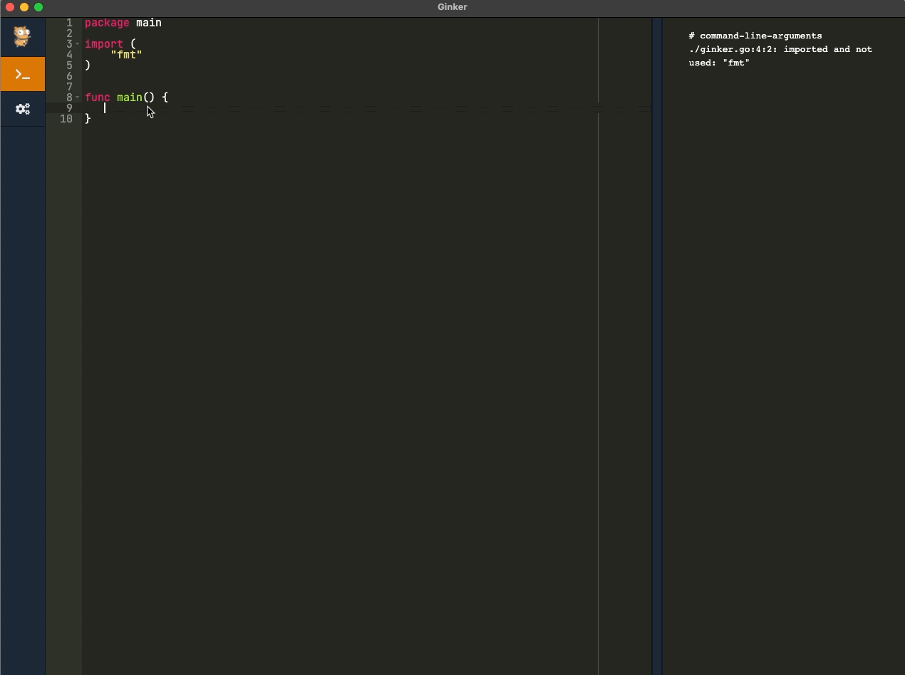

# Ginker 





Ginker is a GUI application for auto-evaluating your Golang code. It allows you to write and run Golang code on the fly and it will help you to quickly prototype new ideas.

It's similar to [Go Playground](https://play.golang.org/) but instead of using a web service, it will evaluate your Golang code locally using your Golang binary.

## Install/run

### macOS

Install from [.dmg](https://github.com/nkoporec/ginker/releases) and run as any other application.

### Windows

Currently not suported.

### Linux

Extract the .tar.gz and run the executable

## Compiling

Ginker is built using [Wails](https://github.com/wailsapp/wails)

* Install Go [https://golang.org/dl/](https://golang.org/dl/)

* Install required dependencies

#### MacOS

Make sure you have the xcode command line tools installed. This can be done by running:

`xcode-select --install`

#### Linux

##### Debian/Ubuntu

`sudo apt install libgtk-3-dev libwebkit2gtk-4.0-dev`

_Debian: 8, 9, 10_

_Ubuntu: 16.04, 18.04, 19.04_

_Also succesfully tested on: Zorin 15, Parrot 4.7, Linuxmint 19, Elementary 5, Kali, Neon_, Pop!_OS

##### Arch Linux / ArchLabs / Ctlos Linux

`sudo pacman -S webkit2gtk gtk3`

### Clone and build the app

```shell
git clone git@github.com:nkoporec/ginker.git
cd ginker
wails build
```

For more info on cross-compiling, see Wails docs.

## Credits ##

Ginker icon is part of [Gophers](https://github.com/egonelbre/gophers) pack.

## License ##

Copyright (c) 2021 nkoporec <br>
Licensed under the MIT license.
